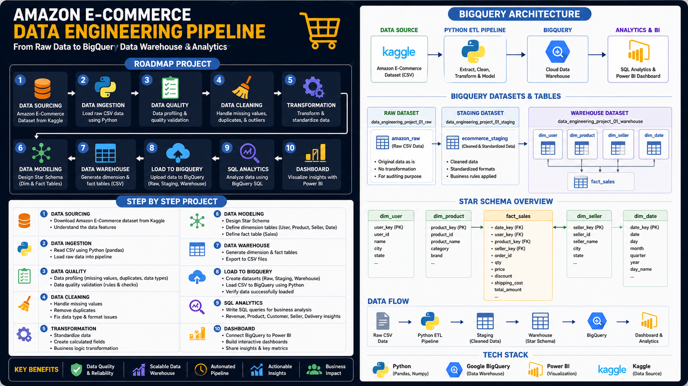

# Amazon E-Commerce Data Engineering Pipeline

An end-to-end data engineering portfolio project that processes an Amazon e-commerce dataset from raw CSV data into a structured analytical data warehouse using **Python, Pandas, and Google BigQuery**.

The project demonstrates the fundamental stages of a data engineering workflow, including data loading, profiling, data quality validation, data cleaning, transformation, data modeling, data warehousing, and business analytics using Power BI.

---

## 📋 Project Overview

This project uses an Amazon e-commerce dataset containing **1,000,000 transaction records**.

The objective is to transform raw transactional data into a structured **Star Schema** consisting of a central fact table and several dimension tables.

The processed data is then loaded into **Google BigQuery** as an analytical data warehouse and connected to **Power BI** to create an interactive business dashboard.

### Project Objectives

- Load and inspect raw e-commerce data
- Perform data profiling and exploratory analysis
- Validate data quality
- Clean inconsistent and missing data
- Transform raw columns into analytical features
- Design a dimensional data model
- Build a Star Schema
- Load structured data into Google BigQuery
- Create an analytical Power BI dashboard

---

## 🗺️ Project Roadmap



---

## 🏗️ Database Structure

The final analytical database follows a **Star Schema** design with `fact_sales` as the central fact table connected to multiple dimension tables.


---

## 📈 Power BI Dashboard

The final data warehouse is connected to Power BI to create an executive-level sales dashboard containing key performance indicators and revenue analysis.


### Dashboard Highlights

- Total Revenue
- Total Sales
- Total Discount
- Return Rate
- Average Order Value
- Revenue Trend
- Revenue by Product Category
- Revenue by Payment Method

---

## 📊 Dataset

This project uses the **Amazon E-Commerce Dataset** with 1,000,000 transaction records.

### Data Sources

| Source | Link | Description |
|--------|------|-------------|
| **Kaggle (Original)** | [Amazon E-Commerce Dataset](https://www.kaggle.com/datasets/sharmajicoder/amazon-e-commerce/data) | Original raw dataset containing 20 columns |
| **Google Drive (Processed)** | [Processed Dataset](https://drive.google.com/file/d/1k1WXrUTdVjUDP6RV6NdRlXBmlCzjEUGH/view?usp=drive_link) | Cleaned and transformed dataset containing 34 columns |

### Dataset Information

| Attribute | Value |
|-----------|-------|
| Total Records | 1,000,000 |
| Raw Columns | 20 |
| Processed Columns | 34 |
| File Size | ~130 MB |
| Format | CSV |
| Date Range | 2024-03-31 to 2026-03-31 |

> **Note:** The processed dataset is not stored directly in this repository because of GitHub file size limitations. The processed dataset can be downloaded from the Google Drive link above.

---

## 🏗️ Data Engineering Workflow

The project follows an end-to-end data engineering workflow:

```text
Raw CSV Dataset
       |
       v
1. Data Loading
       |
       v
2. Data Profiling
       |
       v
3. Data Quality Validation
       |
       v
4. Data Cleaning
       |
       v
5. Data Transformation
       |
       v
6. Data Modeling
       |
       v
7. Data Warehouse
       |
       v
8. Google BigQuery
       |
       v
9. Power BI
       |
       v
10. Analytics Dashboard
